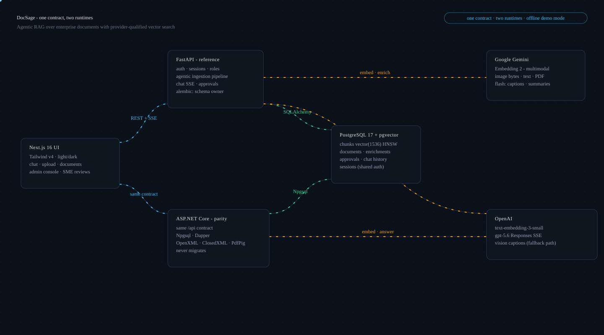
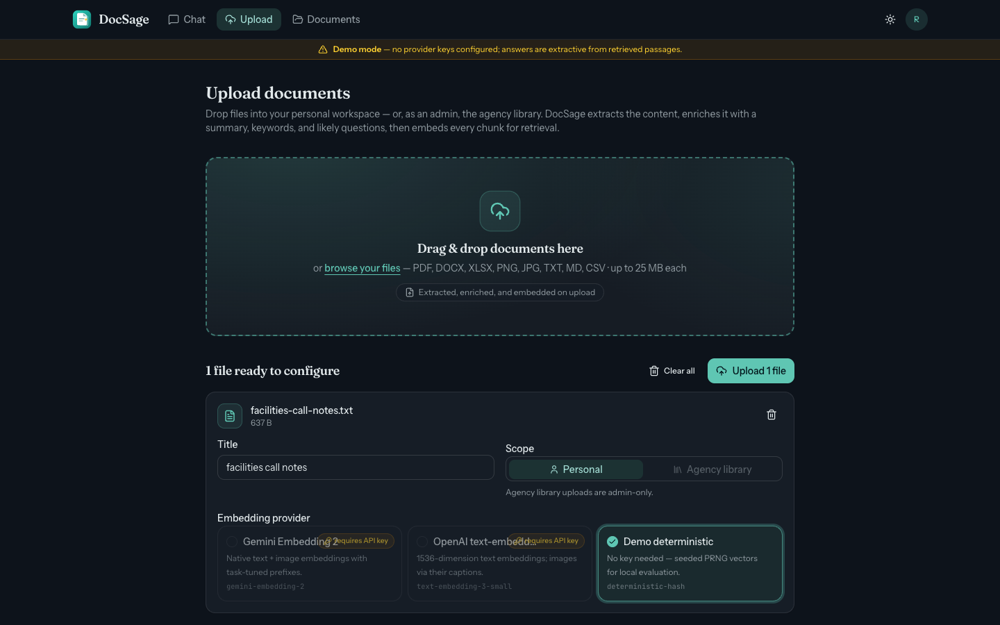
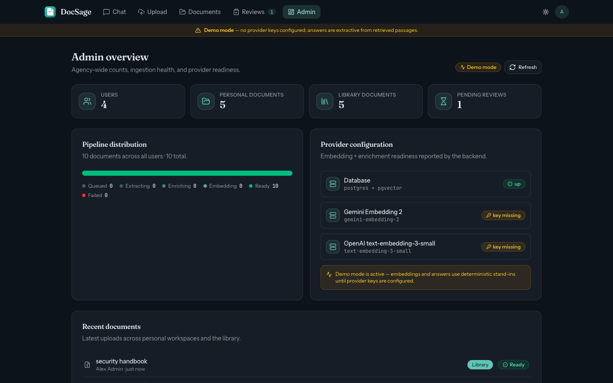

# DocSage - agentic document intelligence

**Your documents, distilled into answers you can verify.**

DocSage is a full-stack RAG platform for enterprise and agency knowledge:
upload Word, Excel, PDF, images, or plain text; an **agentic pipeline**
extracts, enriches, and embeds them; a chat interface answers questions with
**citations back to the source page**. A subject-matter-expert approval
hierarchy gates what becomes agency-wide truth.

<p align="center">
  
</p>

## Why it's interesting

- **Agentic ingestion, not chunk-and-forget.** At upload, model passes write a
  summary, keywords, *the questions users will actually ask*, table preambles,
  and vision captions for images - persisted as data, so retrieval at question
  time stays a single indexed vector search. The vocabulary gap between
  "maximum three remote days" and "can I work from home four days a week" is
  closed at ingestion, once per document.
- **Dual embedding providers, chosen per document.** Google
  **Gemini Embedding 2** - natively multimodal, so PNG/JPEG chunks embed
  straight from pixels - or **OpenAI text-embedding-3-small**, where images
  enter the index through generated captions. Both store into one
  `vector(1536)` pgvector column; vector spaces are provider-qualified so a
  mixed corpus never compares incompatible geometries.
- **Trust hierarchy.** Personal documents are private to their owner. Agency
  library documents are filed under topics with designated **subject matter
  experts**; nothing is visible agency-wide until an SME approves it, and the
  uploader can never approve their own upload. An admin-only chat scope
  searches across every user - and says so on the screen.
- **One contract, two runtimes.** A FastAPI reference implementation and an
  ASP.NET Core parity implementation serve the identical REST contract
  against the same database - shared argon2id password hashes, shared
  sessions, even a byte-identical deterministic demo embedding algorithm.
- **Runs with zero API keys.** A deterministic offline demo provider (hash-
  seeded PRNG vectors, identical in Python and C#) drives the whole product -
  pipeline, approvals, citations - so a reviewer can clone and chat in
  minutes.

## Screenshots

| Chat with citations | Agentic upload pipeline |
|---|---|
|  |  |

| Provider choice at upload | SME review queue |
|---|---|
|  |  |

| Admin console | Light mode |
|---|---|
|  |  |

<p align="center">
  
</p>

## The stack

| Layer | Choice |
|---|---|
| Frontend | Next.js 16 (App Router, React 19), Tailwind CSS v4, shadcn-style primitives, dark/light themes |
| Reference API | Python 3.13, FastAPI, SQLAlchemy 2 + psycopg 3, alembic |
| Parity API | .NET 10 minimal APIs, Npgsql + Dapper, OpenXML / ClosedXML / PdfPig extractors |
| Database | PostgreSQL 17 + pgvector (`vector(1536)`, HNSW cosine) |
| Providers | Google `gemini-embedding-2` (+ flash for enrichment), OpenAI `text-embedding-3-small` + `gpt-5.6` Responses streaming; deterministic demo mode |

## Quick start

```bash
docker compose up -d db
cd backend && uv sync && cp ../.env.example .env \
  && uv run alembic upgrade head \
  && uv run python -m docsage_api.seed --fresh \
  && uv run uvicorn docsage_api.main:app --port 8000 --reload
cd ../frontend && npm install && cp .env.local.example .env.local && npm run dev -- --port 3000
```

Open http://localhost:3000 and sign in as `riley@docsage.dev` /
`docsage-demo` (also `admin@`, `morgan@`, `casey@` - see
[docs/onboarding.md](docs/onboarding.md) for what each account demonstrates).
No API keys needed - add `GEMINI_API_KEY` / `OPENAI_API_KEY` to unlock real
providers, and the upload screen's provider cards light up automatically.

## Documentation

- **[Onboarding](docs/onboarding.md)** - clone to chatting in ten minutes
- **[The questions we had to answer](docs/challenges.md)** - the build
  narrative: why enrichment, why 1536 dimensions, why SMEs can't self-approve
- **[Embedding research](docs/embedding-research.md)** - Gemini Embedding 2
  vs OpenAI text-embedding-3, verified against vendor documentation
- **[ADRs](docs/adr/)** - dual backends, uniform vector column,
  provider-qualified spaces, agentic ingestion, access model, demo mode,
  cross-runtime auth
- **[Contract](docs/CONTRACT.md)** - the schema, endpoints, and pipeline
  rules both backends implement

## Repository layout

```
backend/    FastAPI reference implementation (uv, alembic, pytest)
frontend/   Next.js 16 application
dotnet/     ASP.NET Core parity API + xUnit tests
db/         docker compose stack + demo seed corpus (real docx/xlsx/pdf/png)
docs/       contract, ADRs, research, narrative, diagrams, screenshots
scripts/    dev.sh - one command, three processes
```

## Testing

```bash
cd backend  && uv run pytest -q    # 23 integration tests (real pgvector)
cd dotnet   && dotnet test         # 21 tests incl. cross-runtime vector parity
cd frontend && npm run lint && npm run build
```

CI runs all three jobs against a pgvector service container on every push.

---

*DocSage is a portfolio project by Alex Torres.*
