# DocSage - agentic document intelligence

**Your documents, distilled into answers you can verify.**

DocSage is a full-stack RAG platform for enterprise and agency knowledge:
upload Word, Excel, PDF, images, or plain text; an **agentic pipeline**
extracts, enriches, and embeds them; a chat interface answers questions with
**citations back to the source page**. A subject-matter-expert approval
hierarchy gates what becomes agency-wide truth.

[](https://github.com/Alex5350/docsage/actions/workflows/ci.yml)

> **Two ways to read this page.** Not an engineer? Everything below the
> pictures stays in plain language: the problem, what the product delivers,
> and how the engineering solves it; jargon links to the
> [glossary](docs/GLOSSARY.md). Engineer? The deep dive lives in
> [TECHNICAL.md](TECHNICAL.md): architecture, end-to-end walks of one question
> and one document, and every major decision mapped back to the business
> problem it solves.

## The problem

Agencies and enterprises sit on thousands of pages of policy nobody can query:
telework rules, budget spreadsheets, security procedures, living as files on a
drive. A document owner publishes them and hopes people find them; staff ask
in different words than the documents are written ("can I work from home four
days a week?" never matches "maximum three remote days per week"), search
misses, and the question ends up as an email to the right department. When a
generic chat tool answers policy questions in confident prose, nobody can act
on the answer, because nothing says which document, or which page, said it.

## The product in pictures

The full journey, in order: upload a document, the pipeline enriches it, a
subject matter expert reviews it, approval gates what becomes agency-wide,
people ask questions and get cited answers, and an admin keeps watch.

| Landing (dark) | Sign in with a demo account |
|:---:|:---:|
| 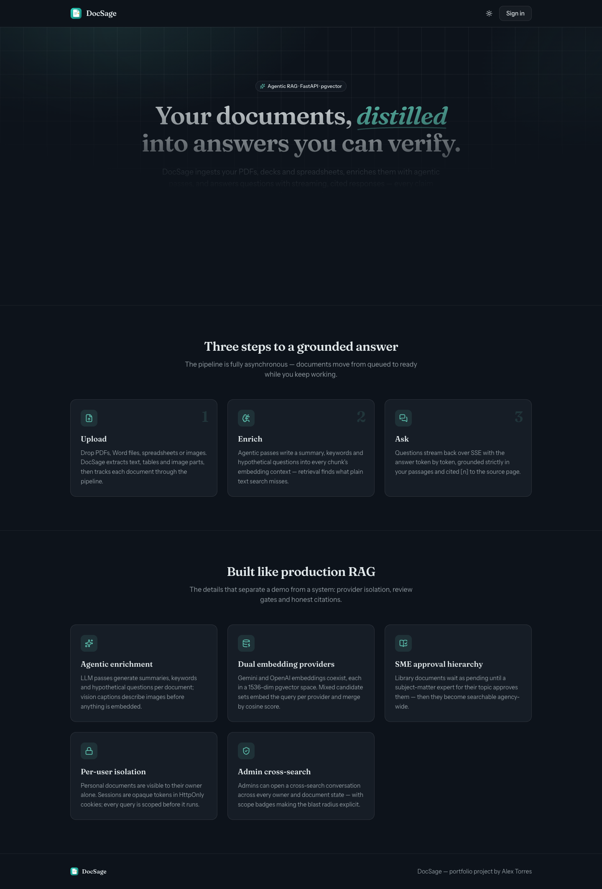 | 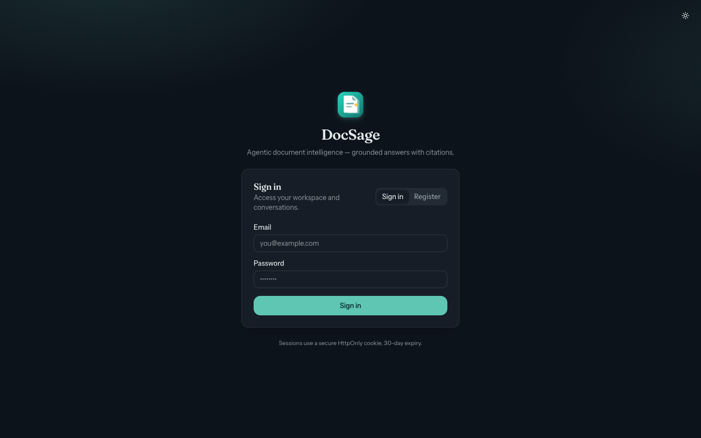 |

Visitors land on the product pitch; the login screen offers four demo accounts
(a regular user, the admin, and two SME reviewers, all password
`docsage-demo`), so a reviewer steps into each role without a signup flow.

| Upload a document | The ingestion pipeline runs |
|:---:|:---:|
| 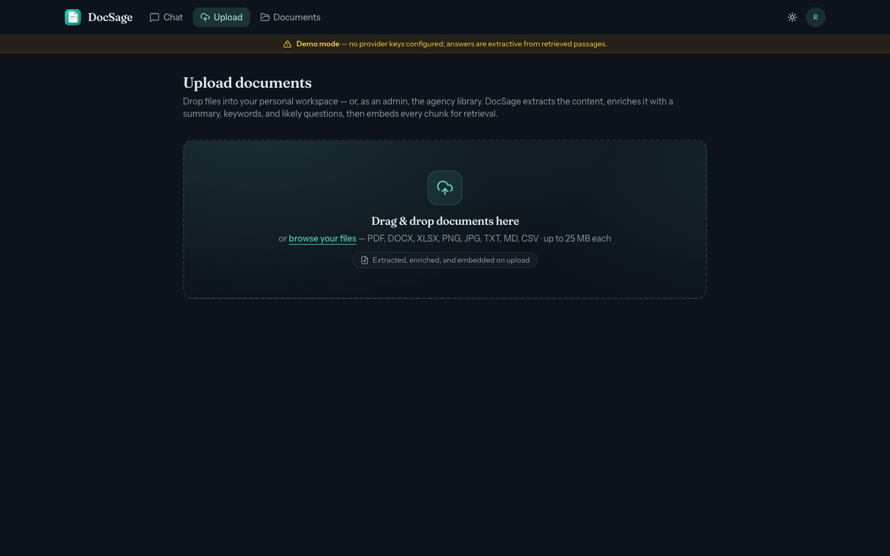 | 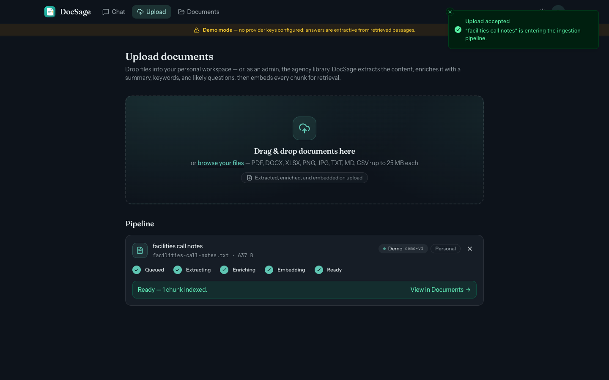 |

The upload screen makes the provider a per-document decision: Demo works with
no keys; Gemini and OpenAI carry a "requires API key" badge until configured.
After upload, the pipeline runs in the background and shows each stage as it
happens.

<p align="center">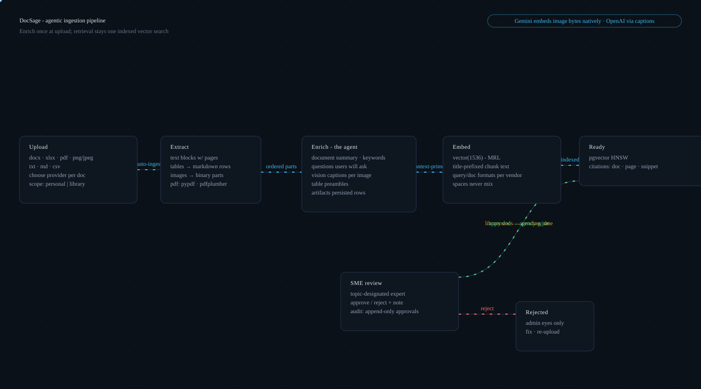</p>

| Pipeline finished | What the pipeline wrote |
|:---:|:---:|
| 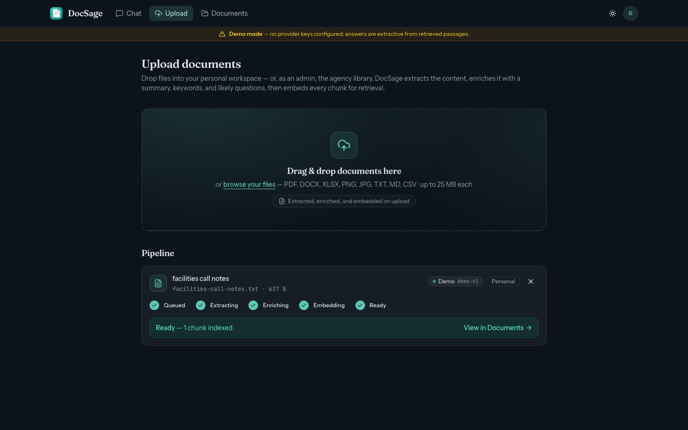 | 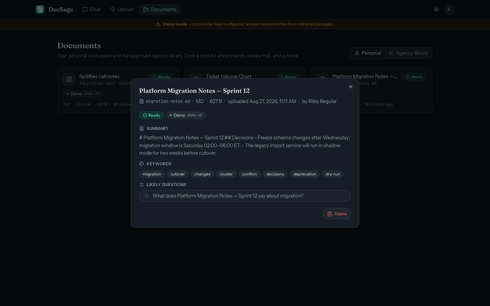 |

Ready means searchable. The detail view opens the hood: an SME can inspect the
summary, keywords, and likely questions the pipeline wrote, and judge the
document on that basis.

| Admin files it under a topic | Awaiting SME approval |
|:---:|:---:|
| 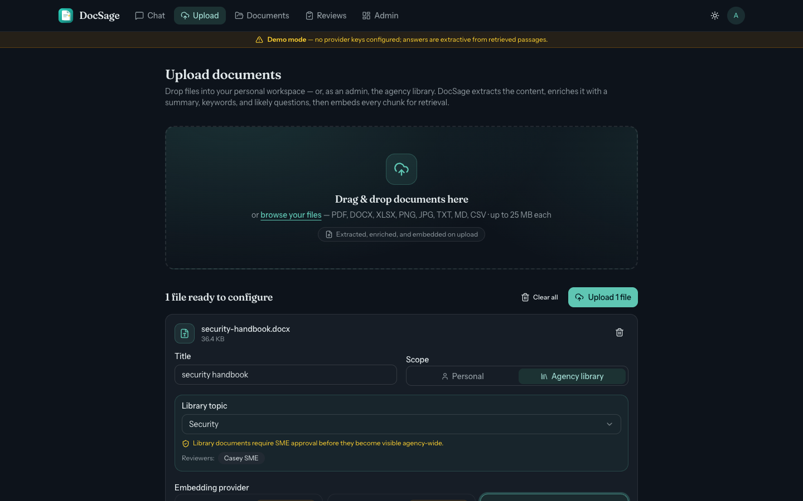 | 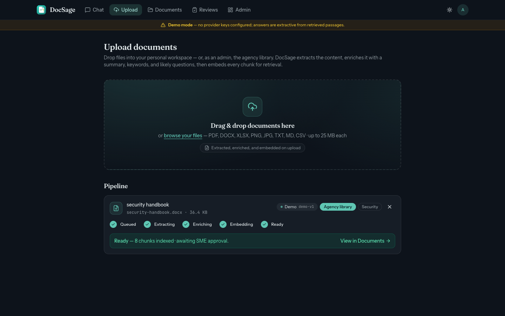 |

An admin ingests library documents under topics (Workplace Policy, Budget and
Finance, Security) and a reviewers chip names the SMEs who hold approval
authority for that topic. Until one of them records a decision, the document
stays invisible to regular users.

| The SME review queue | Approval, with a note |
|:---:|:---:|
| 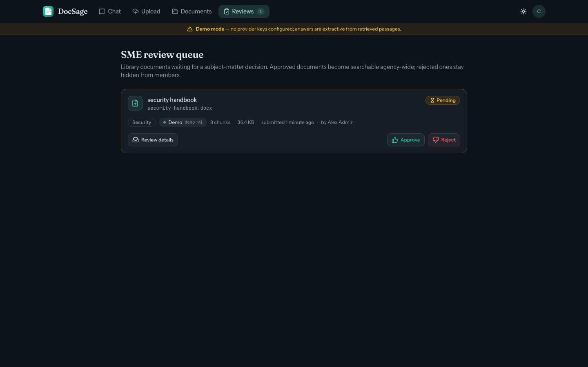 | 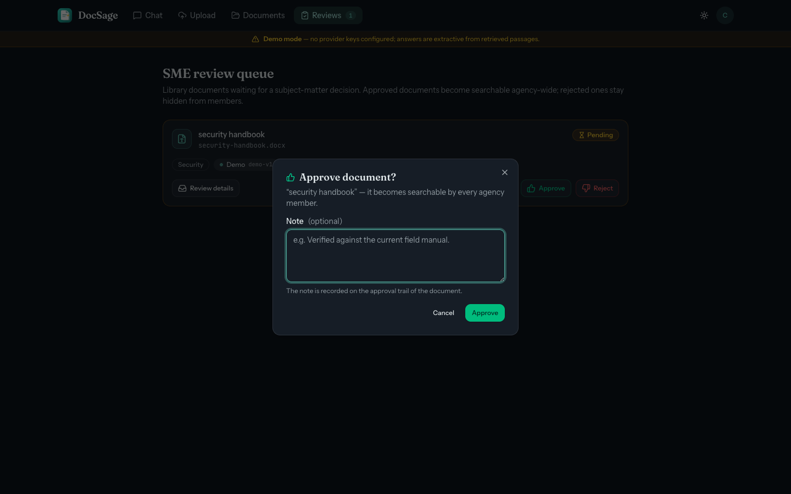 |

Each SME gets a queue built from the topics they cover; a decision carries an
optional note and lands as an append-only audit record naming who accepted the
content.

| Ask in plain words | Get the page, not just prose |
|:---:|:---:|
| 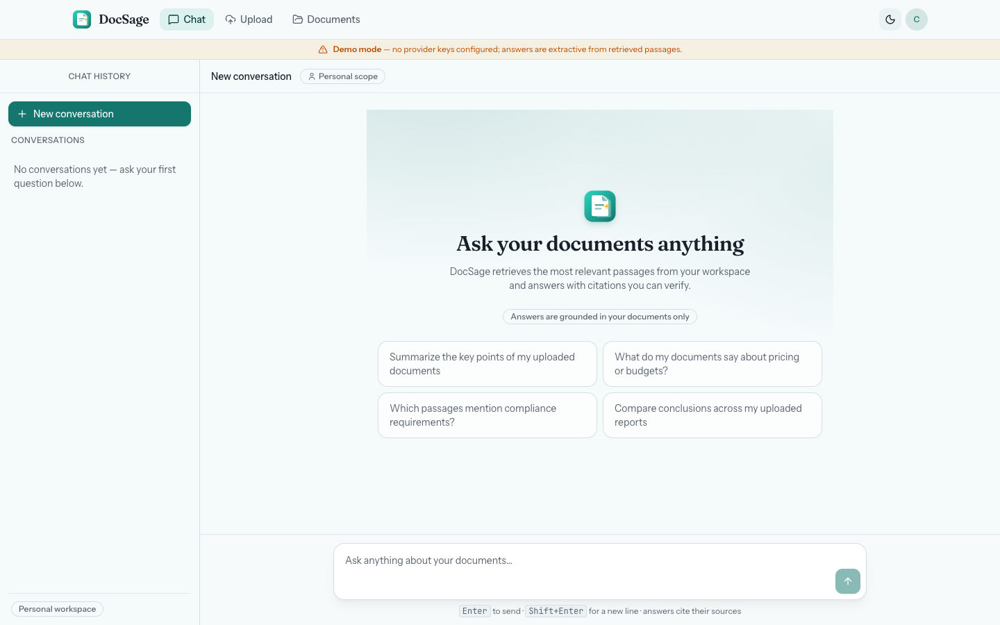 | 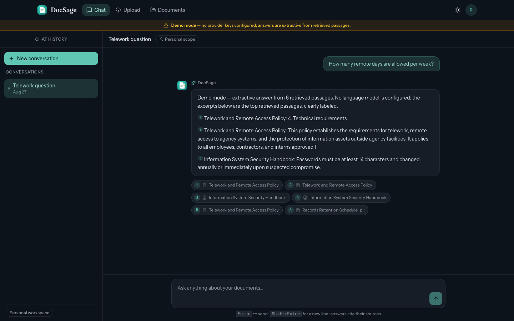 |

A new conversation starts from suggested questions (light mode). Asking "How
many remote days are allowed per week?" returns an answer with citation chips
naming the source documents and pages, so the reader can check the policy
itself.

| Spreadsheets answer too | Admin oversight, labeled |
|:---:|:---:|
| 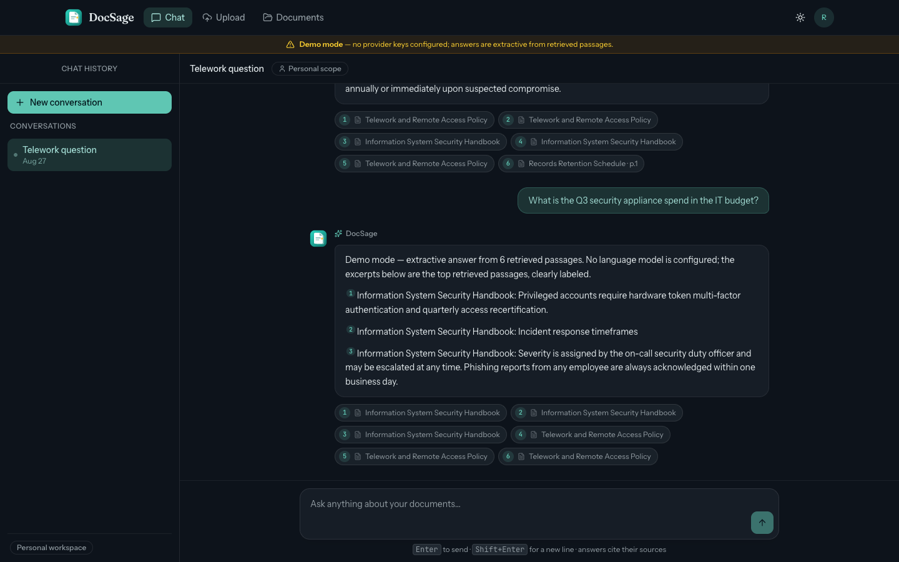 | 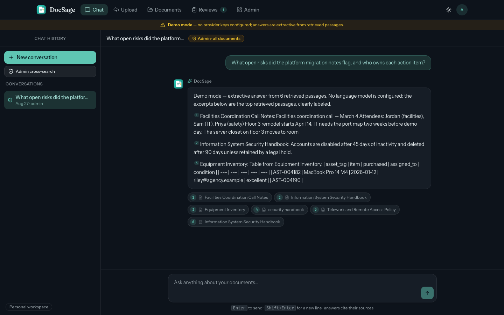 |

A budget question is answered with citations into the spreadsheet that holds
the numbers. The admin cross-search reads across every user and every
pipeline state, and says so on the screen, because a compliance power that is
invisible is not a control.

## What it delivers

- **Answers that cite the page they came from.** Citation chips name the
  source document, and the page when the source has pages; nothing arrives as
  floating prose, and demo-mode answers are labeled as demo, never presented
  as model output.
- **A trust hierarchy, not just a search box.** Personal uploads stay private
  to their owner; nothing becomes agency-wide until a subject matter expert
  for the topic approves it; the uploader can never approve their own upload;
  every decision is an append-only audit row with an optional note.
- **The vocabulary gap closed once, at ingestion.** The pipeline writes a
  summary, keywords, and the questions users will actually ask, so staff
  asking in their own words still find the policy that was written in
  document language.
- **Charts and scans searchable like text.** Tables get preamble lines and
  images get captions (or embed straight from pixels), so a budget
  spreadsheet and a scanned chart can return cited answers.
- **The whole product with zero API keys.** Demo mode drives the pipeline,
  approvals, and cited chat deterministically: a reviewer can clone and chat
  in minutes, and the upload screen badges which providers need keys.

## How the engineering solves it

Plain-terms bridge; each item is told in full in [TECHNICAL.md](TECHNICAL.md).

- **AI cost per question makes a knowledge base expensive.** The model work
  (summaries, keywords, hypothetical questions, captions) is paid once per
  document at ingestion, so question time stays a single indexed search -
  the right trade for a knowledge base that is read many times after it is
  written. ([agentic enrichment](TECHNICAL.md#how-the-tech-solves-the-business-problem))
- **A policy answer nobody stands behind cannot drive decisions.** SMEs are
  designated per topic, self-approval is blocked, and the audit row names who
  accepted the content: accountability is a structure in the data, not a
  hope. ([SME access model](TECHNICAL.md#how-the-tech-solves-the-business-problem))
- **An API contract drifts the day it gets a second implementation.** Two
  independent backends (FastAPI and ASP.NET Core) implement one contract, and
  one E2E suite runs unchanged against both, so drift gets caught, not
  shipped. ([dual backends](TECHNICAL.md#how-the-tech-solves-the-business-problem))
- **Charts and scans are invisible to text-only search.** Multimodal
  embeddings bring them into the same searchable space as text, from pixels
  (Gemini) or generated captions (OpenAI).
  ([agentic enrichment](TECHNICAL.md#how-the-tech-solves-the-business-problem))
- **A reviewer cannot evaluate a system that demands keys.** A deterministic
  offline provider, byte-identical in Python and C#, runs the entire product
  with no credentials - the same property CI depends on.
  ([offline demo mode](TECHNICAL.md#how-the-tech-solves-the-business-problem))

<details>
<summary><b>For developers: quickstart</b></summary>

Prerequisites: Docker, Python 3.13 + [uv](https://docs.astral.sh/uv/), Node.js
22 (.NET 10 only for the parity API). No API keys required.

```bash
docker compose up -d db
cd backend && uv sync && cp ../.env.example .env \
  && uv run alembic upgrade head \
  && uv run python -m docsage_api.seed --fresh \
  && uv run uvicorn docsage_api.main:app --port 8000 --reload
cd ../frontend && npm install && cp .env.local.example .env.local && npm run dev -- --port 3000
```

The API exposes a live OpenAPI explorer at http://localhost:8000/docs
(Swagger UI) generated from the same models that power the endpoints.

Open http://localhost:3000 and sign in as `riley@docsage.dev` /
`docsage-demo` (also `admin@`, `morgan@`, `casey@` - see
[docs/onboarding.md](docs/onboarding.md) for what each account demonstrates,
including how to point the frontend at the ASP.NET Core backend). Add
`GEMINI_API_KEY` / `OPENAI_API_KEY` to unlock real providers, and the upload
screen's provider cards light up automatically.

Repository layout:

```
backend/    FastAPI reference implementation (uv, alembic, pytest)
frontend/   Next.js 16 application
dotnet/     ASP.NET Core parity API + xUnit tests
db/         docker compose stack + demo seed corpus (real docx/xlsx/pdf/png)
docs/       contract, ADRs, research, narrative, diagrams, screenshots
e2e/        Playwright user-journey suite (runs against both backends)
scripts/    dev.sh - one command, three processes
```

Tests, counts, and the dual-backend parity story live in
[TECHNICAL.md](TECHNICAL.md#testing).

</details>

## Documentation

| Document | What it covers | Audience |
|---|---|---|
| [TECHNICAL.md](TECHNICAL.md) | Architecture, request and ingestion flows, decisions mapped to business problems, stack rationale, testing | Engineers |
| [docs/GLOSSARY.md](docs/GLOSSARY.md) | Every term this repo uses, in plain English and precisely | Everyone |
| [docs/onboarding.md](docs/onboarding.md) | Clone to chatting in ten minutes; switching between the two backends | Developers |
| [docs/providers.md](docs/providers.md) | Step-by-step API keys for Gemini, OpenAI, OpenAI-compatible endpoints; adding a new provider | Operators |
| [docs/challenges.md](docs/challenges.md) | The build narrative: why enrichment, why 1536 dimensions, why SMEs cannot self-approve | Engineers |
| [docs/embedding-research.md](docs/embedding-research.md) | Gemini Embedding 2 vs OpenAI text-embedding-3, verified against vendor documentation | Engineers |
| [docs/adr/](docs/adr/) | Seven architecture decision records: dual backends, uniform vector column, provider-qualified spaces, agentic ingestion, access model, demo mode, cross-runtime auth | Engineers |
| [docs/CONTRACT.md](docs/CONTRACT.md) | The schema, endpoints, and pipeline rules both backends implement | Engineers |
| [docs/limitations.md](docs/limitations.md) | What DocSage deliberately does not do yet, and the honest extension paths | Engineers |
| [e2e/README.md](e2e/README.md) | The E2E suite: coverage, running it against either backend, writing your own | Engineers |

## License

DocSage is a portfolio project by Alex Torres. [MIT](LICENSE).
